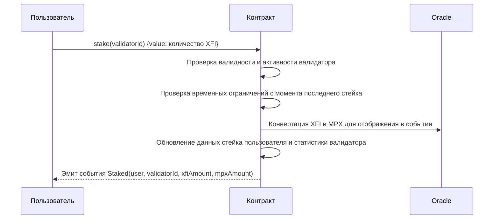
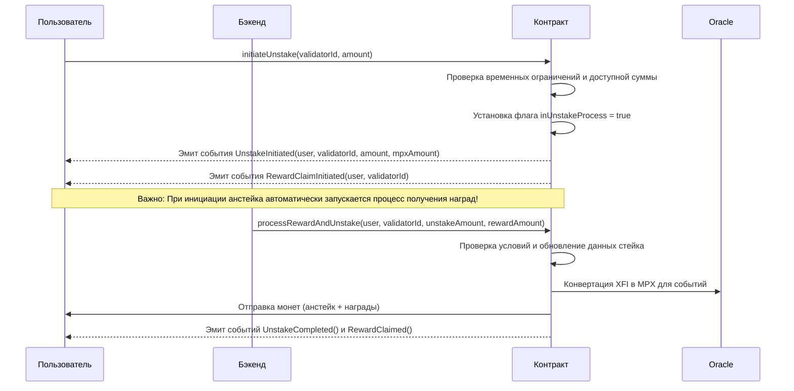
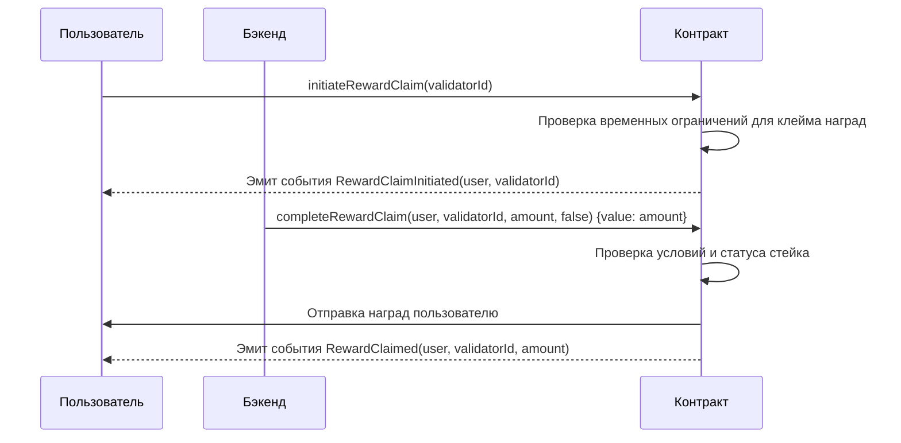
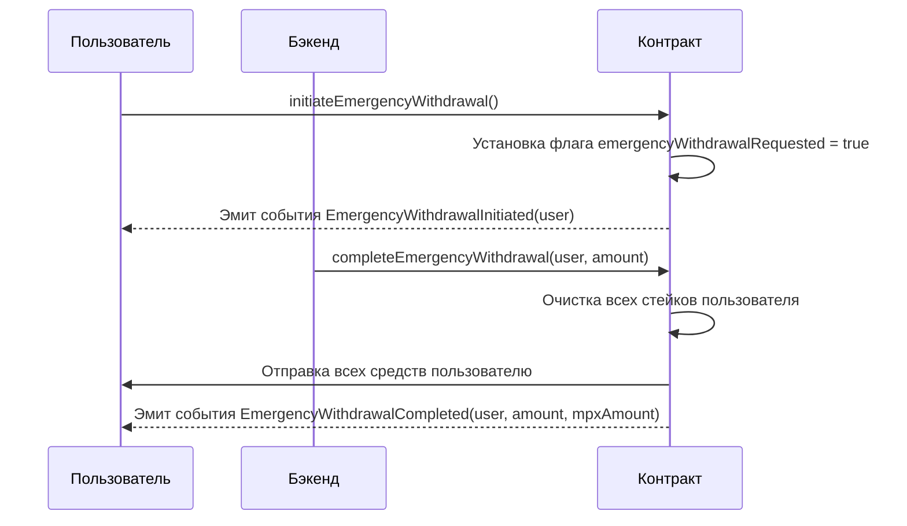
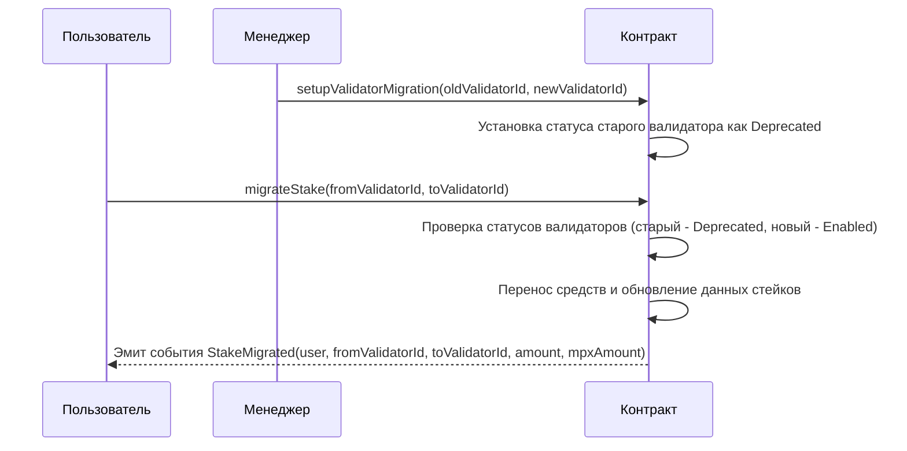
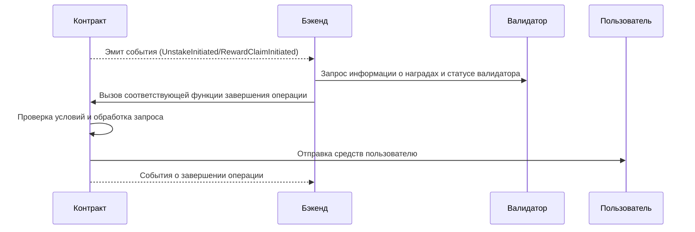
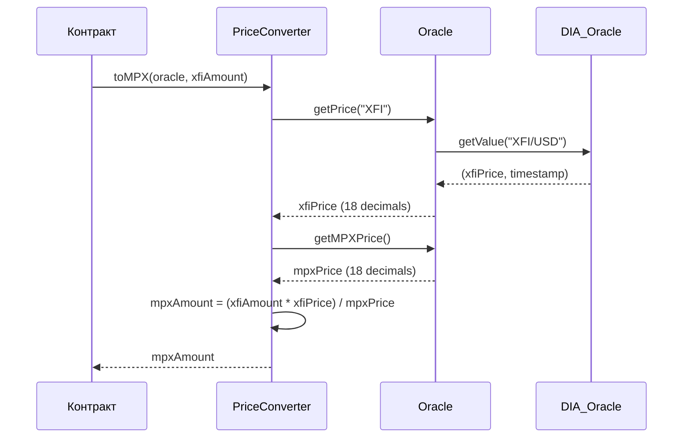

# Документация по контракту NativeStaking

## Содержание
1. [Обзор контракта](#обзор-контракта)
2. [Роли и разрешения](#роли-и-разрешения)
3. [Основные потоки](#основные-потоки)
4. [Взаимодействие с бэкендом](#взаимодействие-с-бэкендом)
5. [Конвертация XFI/MPX](#конвертация-xfimpx)
6. [Ограничения](#ограничения)
7. [Руководство по развертыванию](#руководство-по-развертыванию)

## Обзор контракта

`NativeStaking` - это смарт-контракт для стейкинга нативных токенов XFI в валидаторы сети CrossFi. Контракт разработан для предоставления пользователям возможности делегировать свои токены XFI валидаторам и получать вознаграждение за участие в сетевых операциях.

Основные возможности:
- **Стейкинг XFI**: Пользователи могут стейкать свои токены XFI любому активному валидатору из списка доступных
- **Двухэтапный анстейкинг**: Процесс изъятия средств состоит из инициации (пользователем) и завершения (оператором)
- **Получение наград**: Пользователи могут запрашивать и получать свои награды через двухэтапный процесс
- **Экстренный вывод средств**: В чрезвычайных ситуациях пользователи могут запросить вывод всех средств
- **Миграция стейков**: Возможность переноса средств между валидаторами при необходимости
- **Обновляемость контракта**: Поддержка прокси-шаблона для будущих обновлений функциональности

Контракт спроектирован с использованием паттерна обновляемого прокси, что позволяет вносить изменения в логику без потери состояния и данных. Он включает функции для управления валидаторами, установки временных ограничений и обработки операций стейкинга.

## Роли и разрешения

Система ролей и разрешений в контракте основана на OpenZeppelin AccessControl, что обеспечивает гибкую и безопасную модель управления. В контракте определены следующие роли:

| Роль | Константа | Описание |
|------|-----------|----------|
| Администратор | DEFAULT_ADMIN_ROLE | Управление всеми ролями и полный доступ к контракту. Может назначать и отзывать роли других пользователей. |
| Менеджер | MANAGER_ROLE | Управление параметрами контракта, включая добавление/обновление валидаторов, настройку временных интервалов, приостановку операций. |
| Оператор | OPERATOR_ROLE | Техническая роль для бэкенда, отвечающая за завершение процессов анстейкинга и выплаты наград пользователям. |

Такое разделение ролей обеспечивает принцип наименьших привилегий и позволяет структурировать управление контрактом.

### Ключевые функции для Администратора

Администратор может управлять ролями в системе:

```solidity
// src/core/NativeStaking.sol
// Предоставление роли указанному адресу
function grantRole(bytes32 role, address account) external;

// Отзыв роли у указанного адреса
function revokeRole(bytes32 role, address account) external;
```

### Ключевые функции для Менеджера

Менеджер отвечает за настройку параметров контракта:

```solidity
// src/core/NativeStaking.sol
// Добавление нового валидатора в систему
function addValidator(string calldata validatorId, bool isEnabled) external;

// Управление статусом валидатора (включен, отключен, устарел)
function updateValidatorStatus(string calldata validatorId, ValidatorStatus status) external;

// Установка минимальных временных интервалов для операций
function setMinStakeInterval(uint256 interval) external;
function setMinUnstakeInterval(uint256 interval) external;
function setMinClaimInterval(uint256 interval) external;

// Приостановка и возобновление операций
function pauseStaking() external;
function unpauseStaking() external;
```

### Ключевые функции для Оператора

Оператор выполняет завершающие этапы операций:

```solidity
// src/core/NativeStaking.sol
// Завершение процесса анстейкинга
function completeUnstake(address staker, string calldata validatorId, uint256 amount) external;

// Выплата наград пользователю
function completeRewardClaim(
    address staker, 
    string calldata validatorId, 
    uint256 amount,
    bool isInitiatedDueUnstake
) external payable;

// Комбинированный процесс анстейкинга и выплаты наград
function processRewardAndUnstake(
    address staker, 
    string calldata validatorId, 
    uint256 unstakeAmount,
    uint256 rewardAmount
) external;
```

### Ключевые функции для пользователей

Пользователи могут выполнять следующие основные операции:

```solidity
// src/core/NativeStaking.sol
// Стейкинг токенов XFI к выбранному валидатору
function stake(string calldata validatorId) external payable;

// Запрос на вывод средств (первый этап анстейкинга)
function initiateUnstake(string calldata validatorId, uint256 amount) external;

// Запрос на получение наград
function initiateRewardClaim(string calldata validatorId) external;

// Запрос на экстренный вывод всех средств
function initiateEmergencyWithdrawal() external;
```

## Основные потоки

### Процесс стейкинга

Стейкинг - это основная операция, позволяющая пользователям делегировать свои XFI валидаторам. Процесс происходит в один этап:



**Важные детали процесса стейкинга:**
- При повторном стейке к тому же валидатору, новая сумма **добавляется** к существующему стейку
- Временная метка стейка (`stakedAt`) обновляется при каждом новом стейке
- Минимальный интервал между стейками определяется параметром `_minStakeInterval`
- Контракт отслеживает общую сумму стейка по каждому валидатору и количество уникальных стейкеров

### Процесс анстейкинга

Анстейкинг - это двухэтапный процесс, который требует взаимодействия пользователя и оператора (бэкенда):



**Важные детали процесса анстейкинга:**
- Пользователь может анстейкать только после истечения периода `_minUnstakeInterval` с момента стейкинга
- При инициации анстейка автоматически генерируется событие `RewardClaimInitiated`
- Операция может быть приостановлена глобально с помощью флага `_isUnstakePaused`
- Для завершения процесса бэкенд использует функцию `processRewardAndUnstake`, которая одновременно обрабатывает анстейк и выплату наград

### Процесс получения наград

Получение наград также реализовано как двухэтапный процесс:



**Важные детали процесса получения наград:**
- Пользователь может запросить награды только после истечения периода `_minClaimInterval` с момента стейкинга
- Контракт не проверяет минимальную сумму наград, это ответственность бэкенда
- Награды могут быть получены как отдельно, так и в процессе анстейкинга

### Экстренный вывод средств

Экстренный вывод средств позволяет пользователю в чрезвычайной ситуации вывести все свои средства:



**Важные детали экстренного вывода:**
- После запроса на экстренный вывод пользователь не может выполнять другие операции стейкинга
- Процесс очищает все данные о стейках пользователя и возвращает всю сумму
- Используется только в исключительных ситуациях, когда стандартный анстейкинг невозможен

### Миграция между валидаторами

Миграция стейков используется, когда необходимо перенести средства от одного валидатора к другому:



**Важные детали миграции:**
- Миграция возможна только если старый валидатор имеет статус `Deprecated`, а новый - `Enabled`
- При миграции временная метка стейка обновляется, что сбрасывает временные ограничения
- Процесс миграции выполняется в один этап и не требует участия оператора

## Взаимодействие с бэкендом

Архитектура контракта предполагает тесное взаимодействие с бэкендом для полноценной работы всей системы. Бэкенд играет критическую роль в завершении двухэтапных операций.

### Ответственность бэкенда

Для полноценной работы контракта необходимо наличие бэкенда, который выполняет следующие функции:

1. **Завершение анстейкинга**:
   - Мониторинг события `UnstakeInitiated`
   - Проверка возможности завершения операции
   - Вызов функции `completeUnstake` или `processRewardAndUnstake` с корректными параметрами
   - **Только адрес с ролью OPERATOR_ROLE может выполнять эти действия**

2. **Выплата наград**:
   - Мониторинг события `RewardClaimInitiated`
   - Получение информации о накопленных наградах от сетевых валидаторов
   - Расчет суммы наград с учетом комиссий и других параметров
   - Вызов `completeRewardClaim` с отправкой рассчитанного количества XFI
   - **Важно:** контракт не имеет собственной логики расчета наград и не может проверить минимальную допустимую сумму для клейма

3. **Экстренный вывод средств**:
   - Мониторинг события `EmergencyWithdrawalInitiated`
   - Проверка возможности выполнения экстренного вывода
   - Вызов `completeEmergencyWithdrawal` для возврата всех средств пользователю



### Роль бэкенда в управлении данными

Бэкенд выполняет следующие функции в экосистеме:
1. Поддерживает актуальную информацию о стейках пользователей и валидаторах
2. Отслеживает временные ограничения для всех типов операций
3. Вычисляет награды пользователей на основе данных от валидаторов сети
4. Обеспечивает обработку событий контракта и завершение пользовательских операций
5. Реализует дополнительную бизнес-логику, которая не включена в смарт-контракт

### Критические аспекты взаимодействия

1. **Безопасность ключей оператора**:
   - Приватные ключи с ролью OPERATOR_ROLE должны быть надежно защищены
   - Рекомендуется использование мультиподписей или HSM для повышения безопасности

2. **Обеспечение надежности**:
   - Бэкенд должен быть высокодоступным и надежным
   - Необходимо реализовать механизмы резервного копирования и восстановления

3. **Мониторинг и реагирование**:
   - Необходимо построить систему мониторинга всех событий контракта
   - Важно обеспечить быстрое реагирование на события для улучшения UX

## Конвертация XFI/MPX

Контракт использует сложную систему конвертации между XFI и MPX, основанную на данных Oracle. Эта конвертация необходима для отображения эквивалентных сумм в различных событиях.

### Процесс конвертации



### Ключевые компоненты системы конвертации

1. **PriceConverter** - библиотека для конвертации XFI в MPX
   ```solidity
   // src/libraries/PriceConverter.sol
   function toMPX(IOracle oracle, uint256 xfiAmount) internal view returns (uint256) {
       if (xfiAmount == 0) return 0;
       
       // Получение цен из оракула
       uint256 xfiPrice = oracle.getPrice("XFI");
       uint256 mpxPrice = oracle.getMPXPrice();
       
       // Если какая-либо цена равна нулю, конвертация невозможна
       if (xfiPrice == 0 || mpxPrice == 0) return 0;
       
       // Конвертация с использованием кросс-умножения: 
       // mpxAmount = xfiAmount * xfiPrice / mpxPrice
       return (xfiAmount * xfiPrice) / mpxPrice;
   }
   ```

2. **UnifiedOracle** - контракт, который получает данные о ценах и обеспечивает их доступность
   - Получает курс XFI/USD от DIA Oracle (с 8 десятичными знаками)
   - Преобразует его к стандарту 18 десятичных знаков
   - Хранит курс MPX/USD, устанавливаемый вручную
   - Включает резервные механизмы для случаев недоступности DIA Oracle

3. **DIA Oracle** - внешний оракул, предоставляющий актуальные данные о курсе XFI/USD

### Важные особенности конвертации

- Все цены в системе хранятся с 18 десятичными знаками для совместимости с ERC20 токенами
- DIA Oracle использует 8 десятичных знаков, поэтому требуется конвертация
- Цена MPX/USD может быть установлена вручную через функцию `setMPXPrice`
- В случае недоступности DIA Oracle, система может использовать резервные значения
- Конвертация используется только для событий и не влияет на бизнес-логику контракта

## Ограничения

Контракт имеет ряд ограничений и особенностей, которые важно учитывать при интеграции и использовании:

### 1. Ограничения клейма наград

- **Отсутствие минимальной суммы:**
  Контракт не имеет встроенной проверки минимальной суммы для клейма наград. Эта логика должна реализовываться на уровне бэкенда.
  
- **Отсутствие логики расчета наград:**
  Контракт не рассчитывает награды самостоятельно, а полагается на внешние расчеты, выполняемые бэкендом.

### 2. Временные ограничения

- **Использование timestamp вместо блоков:**
  Контракт использует временные метки (timestamp) вместо номеров блоков, что может быть подвержено некоторой погрешности.
  
- **Настраиваемые интервалы:**
  По умолчанию установлены следующие интервалы, которые могут быть изменены менеджером:
  ```solidity
  _minStakeInterval = 1 days;     // Минимальный интервал между стейками
  _minUnstakeInterval = 1 days;    // Минимальное время до возможности анстейка
  _minClaimInterval = 1 days;      // Минимальное время до возможности клейма наград
  ```

### 3. Взаимосвязь операций

- **Автоматический клейм при анстейке:**
  При вызове `initiateUnstake` автоматически генерируется событие `RewardClaimInitiated`, что требует соответствующей обработки бэкендом:
  ```solidity
  // src/core/NativeStaking.sol, метод initiateUnstake
  // Automatically initiate reward claim for better UX
  emit RewardClaimInitiated(msg.sender, normalizedId);
  ```

### 4. Мониторинг событий

- **Необходимость постоянного мониторинга:**
  Бэкенд должен постоянно отслеживать все события контракта для обеспечения корректной работы системы.
  
- **Ключевые события для мониторинга:**
  ```
  - UnstakeInitiated
  - RewardClaimInitiated
  - EmergencyWithdrawalInitiated
  - ValidatorAdded
  - ValidatorUpdated
  ```

### 5. Особенности стейкинга

- **Накопительный характер:**
  При повторном стейке в один и тот же валидатор, сумма добавляется к существующему стейку, а не создается новый стейк:
  ```solidity
  // src/core/NativeStaking.sol, метод stake
  // Update user stake
  userStake.amount += msg.value;
  userStake.stakedAt = block.timestamp;
  ```

- **Сброс временных ограничений:**
  Каждый новый стейк обновляет временную метку, что сбрасывает все временные ограничения для анстейка и клейма наград.

### 6. Зависимость от оракула

- **Необходимость работающего оракула:**
  Для корректной конвертации XFI/MPX требуется функционирующий оракул с актуальными данными.
  
- **Резервные механизмы:**
  В случае недоступности основного оракула, система может использовать резервные цены, но их нужно своевременно обновлять.

## Руководство по развертыванию

Развертывание контракта `NativeStaking` является многоэтапным процессом, требующим правильной настройки и инициализации. В этом разделе описаны все необходимые шаги для успешного развертывания.

### Предварительные требования

Перед развертыванием необходимо:
1. Установить Foundry (forge, cast, anvil)
2. Иметь достаточное количество ETH/XFI для оплаты газа
3. Подготовить приватные ключи для аккаунтов с разными ролями

### Подготовка переменных окружения

Для корректного развертывания необходимо настроить следующие переменные окружения:

```bash
# Приватный ключ для развертывания (без префикса 0x)
export DEV_PRIVATE_KEY=your_private_key_without_0x_prefix

# Временные интервалы (в секундах)
export MIN_STAKE_INTERVAL=3600    # 1 час
export MIN_UNSTAKE_INTERVAL=86400 # 1 день
export MIN_CLAIM_INTERVAL=43200   # 12 часов

# URL RPC-узла целевой сети
export RPC_URL=https://your-rpc-node.url
```

### Запуск скрипта развертывания

Для развертывания на тестовой или основной сети используйте следующую команду:

```bash
forge script script/DeployNativeStaking.s.sol:DeployNativeStaking --broadcast --rpc-url $RPC_URL -vvv
```

Для локального тестирования можно использовать Anvil:

```bash
# Запуск локального узла
anvil

# В другом терминале выполнить развертывание
forge script script/DeployNativeStaking.s.sol:DeployNativeStaking --broadcast --rpc-url http://localhost:8545 -vvv
```

### Процесс развертывания

Скрипт развертывания выполняет следующие шаги:

1. **Развертывание зависимостей:**
   - Создание mock-оракула для тестирования (в продакшне потребуется настоящий оракул)

2. **Развертывание основных контрактов:**
   - Развертывание имплементации `NativeStaking`
   - Создание `ProxyAdmin` для управления прокси
   - Развертывание `TransparentUpgradeableProxy` с данными инициализации

3. **Начальная настройка:**
   - Инициализация контракта с параметрами
   - Настройка ролей для разных адресов
   - Установка временных интервалов

4. **Вывод информации:**
   - Отображение адресов всех развернутых контрактов
   - Информация о назначенных ролях
   - Установленные временные интервалы

### Послеразвертывания действия

После успешного развертывания необходимо выполнить следующие действия:

1. **Добавление валидаторов:**
   ```solidity
   // Добавление валидаторов через функцию
   nativeStaking.addValidator("validator_id", true);
   ```

2. **Настройка бэкенда:**
   - Настройка мониторинга событий контракта
   - Настройка обработчиков для завершения операций
   - Интеграция с API валидаторов для получения информации о наградах

3. **Назначение ролей:**
   - Предоставление роли OPERATOR_ROLE серверам бэкенда
   - Предоставление роли MANAGER_ROLE администраторам системы

4. **Замена оракула:**
   - В продакшн-среде необходимо заменить mock-оракул на реальный:
   ```solidity
   nativeStaking.setOracle(address_of_real_oracle);
   ```

### Верификация контрактов

После развертывания рекомендуется верифицировать смарт-контракты в сканере блоков:

```bash
forge verify-contract <contract_address> <contract_name> --chain <chain_id> --watch
```

## Заключение

Контракт `NativeStaking` представляет собой сложную систему для стейкинга XFI в валидаторы сети CrossFi. Он обеспечивает безопасные и прозрачные операции стейкинга, анстейкинга и выплаты наград, но требует наличия бэкенда для полноценной работы.

Ключевые особенности контракта:
- Разделение ролей и ответственности между различными участниками
- Двухэтапные процессы для анстейкинга и получения наград
- Гибкая настройка временных ограничений и параметров
- Возможность миграции средств между валидаторами
- Экстренный вывод средств в чрезвычайных ситуациях
- Обновляемость через прокси-паттерн

Для успешной интеграции и использования контракта необходимо тщательное планирование и настройка бэкенд-системы, которая будет взаимодействовать с контрактом и обрабатывать соответствующие события. 